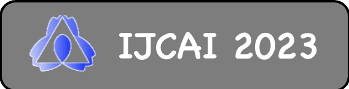
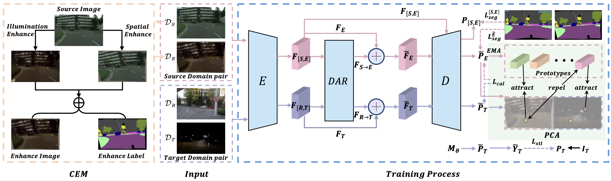

 ---

<div align="center">    
 
# ICDA: Illumination-Coupled Domain Adaptation Framework for Unsupervised Nighttime Semantic Segmentation

[](https://www.ijcai.org/proceedings/2023/75) 

</div>

This repository provides the official code for the IJCAI 2023 paper [ICDA: Illumination-Coupled Domain Adaptation Framework for Unsupervised Nighttime Semantic Segmentation](https://www.ijcai.org/proceedings/2023/0075.pdf). The code is organized using [PyTorch Lightning](https://github.com/Lightning-AI/lightning). 



## Abstract

The performance of nighttime semantic segmen-
tation has been significantly improved thanks to recent unsupervised methods. However, these methods still suffer from complex domain gaps, i.e., the challenging illumination gap and the in-herent dataset gap. In this paper, we propose the illumination-coupled domain adaptation frame-work(ICDA) to effectively avoid the illumination gap and mitigate the dataset gap by coupling day-time and nighttime images as a whole with seman-tic relevance. Specifically, we first design a new composite enhancement method(CEM) that con-siders not only illumination but also spatial con-sistency to construct the source and target do-main pairs, which provides the basic adaptation unit for our ICDA. Next, to avoid the illumina-tion gap, we devise the Deformable Attention Rel-evance(DAR) module to capture the semantic rel-evance inside each domain pair, which can cou-ple the daytime and nighttime images at the fea-ture level and adaptively guide the predictions of nighttime images. Besides, to mitigate the dataset gap and acquire domain-invariant semantic relevance, we propose the Prototype-based Class Alignment(PCA) module, which improves the us-age of category information and performs fine-grained alignment. Extensive experiments show that our method reduces the complex domain gaps and achieves state-of-the-art performance for night-time semantic segmentation.


## Usage
### Requirements

The code is run with Python 3.8.13. To install the packages, use:
```bash
pip install -r requirements.txt
```

### Set Data Directory

The following environment variable must be set:
```bash
export DATA_DIR=/path/to/data/dir
```

### Download the Data

Before running the code, download and extract the corresponding datasets to the directory `$DATA_DIR`.

#### UDA
<details>
  <summary>Cityscapes</summary>
  
  Download leftImg8bit_trainvaltest.zip and gt_trainvaltest.zip from [here](https://www.cityscapes-dataset.com/downloads/) and extract them to `$DATA_DIR/Cityscapes`.

  ```
  $DATA_DIR
  ├── Cityscapes
  │   ├── leftImg8bit
  │   │   ├── train
  │   │   ├── val
  │   ├── gtFine
  │   │   ├── train
  │   │   ├── val
  ├── ...
  ```
  Afterwards, run the preparation script:
  ```bash
  python tools/convert_cityscapes.py $DATA_DIR/Cityscapes
  ```
</details>

<details>
  <summary>ACDC</summary>
  
  Download rgb_anon_trainvaltest.zip and gt_trainval.zip from [here](https://acdc.vision.ee.ethz.ch/download) and extract them to `$DATA_DIR/ACDC`.

  ```
  $DATA_DIR
  ├── ACDC
  │   ├── rgb_anon
  │   │   ├── fog
  │   │   ├── night
  │   │   ├── rain
  │   │   ├── snow
  │   ├── gt
  │   │   ├── fog
  │   │   ├── night
  │   │   ├── rain
  │   │   ├── snow
  ├── ...
  ```
</details>

<details>
  <summary>Dark Zurich</summary>
  
  Download Dark_Zurich_train_anon.zip, Dark_Zurich_val_anon.zip, and Dark_Zurich_test_anon_withoutGt.zip from [here](https://www.trace.ethz.ch/publications/2019/GCMA_UIoU/) and extract them to `$DATA_DIR/DarkZurich`.

  ```
  $DATA_DIR
  ├── DarkZurich
  │   ├── rgb_anon
  │   │   ├── train
  │   │   ├── val
  │   │   ├── val_ref
  │   │   ├── test
  │   │   ├── test_ref
  │   ├── gt
  │   │   ├── val
  ├── ...
  ```
</details>

<details>
  <summary>Nighttime Driving</summary>
  
  Download NighttimeDrivingTest.zip from [here](http://people.ee.ethz.ch/~daid/NightDriving/) and extract it to `$DATA_DIR/NighttimeDrivingTest`.

  ```
  $DATA_DIR
  ├── NighttimeDrivingTest
  │   ├── leftImg8bit
  │   │   ├── test
  │   ├── gtCoarse_daytime_trainvaltest
  │   │   ├── test
  ├── ...
  ```
</details>

<details>
  <summary>BDD100k-night</summary>
  
  Download `10k Images` and `Segmentation` from [here](https://bdd-data.berkeley.edu/portal.html#download) and extract them to `$DATA_DIR/bdd100k`.

  ```
  $DATA_DIR
  ├── bdd100k
  │   ├── images
  │   │   ├── 10k
  │   ├── labels
  │   │   ├── sem_seg
  ├── ...
  ```
</details>


### Pretrained Models

We provide pretrained models for the UDA tasks.

#### UDA
- ICDA [Baidu Yun](https://pan.baidu.com/s/1mY5OIg81jacUHfwoyYt7Zg?pwd=ICDA) or [Google Drive](https://drive.google.com/drive/folders/1P7Qk2z4ZCqW6DmVSdq_zjFqTcq81WLRW?usp=share_link) -- Cityscapes-->DarkZurich, 58.2 mIoU

### Qualitative ICDA Predictions

To facilitate qualitative comparisons, validation set predictions of ICDA can be directly downloaded:
- [ICDA on Dark Zurich test](https://pan.baidu.com/s/1nKdBm-Sw9S624wHSxSE7OA?pwd=rvw4)

### ICDA Training

To train ICDA on Dark Zurich (single GPU, with AMP) use the following command:

```bash
python tools/run.py fit --config configs/cityscapes_darkzurich/ICDA_daformer.yaml --trainer.gpus [0] --trainer.precision 16
```

### ICDA Testing

To evaluate ICDA e.g. on the Dark Zurich validation set, use the following command:

```bash
python tools/run.py validate --config configs/cityscapes_darkzurich/ICDA_daformer.yaml --ckpt_path /path/to/trained/model --trainer.gpus [0]
```

We also provide pretrained models, which can be downloaded from the link above. To evaluate them, simply provide them as the argument `--ckpt_path`.

To get test set scores for DarkZurich, predictions are evaluated on the respective evaluation servers: [DarkZurich](https://codalab.lisn.upsaclay.fr/competitions/3783).
To create and save test predictions, use this command:
```bash
python tools/run.py predict --config configs/cityscapes_darkzurich/ICDA_daformer.yaml --ckpt_path /path/to/trained/model --trainer.gpus [0]

```


## Citation

If you find this code useful in your research, please consider citing the paper:
```bibtex
@inproceedings{dong2023icda,
  title={ICDA: Illumination-Coupled Domain Adaptation Framework for Unsupervised Nighttime Semantic Segmentation.},
  author={Dong, Chenghao and Kang, Xuejing and Ming, Anlong},
  booktitle={IJCAI},
  pages={672--680},
  year={2023}
}
```

## Credit

The pretrained backbone weights and code are from [MMSegmentation](https://github.com/open-mmlab/mmsegmentation). DAFormer code is from the [original repo](https://github.com/lhoyer/DAFormer). Our work is implemented with reference to [Refign](https://github.com/brdav/refign), thanks for their great work.

## Contact

For questions about the code or paper, feel free to contact me ([send email](mailto:dongchenghaozxy@gmail.com)).